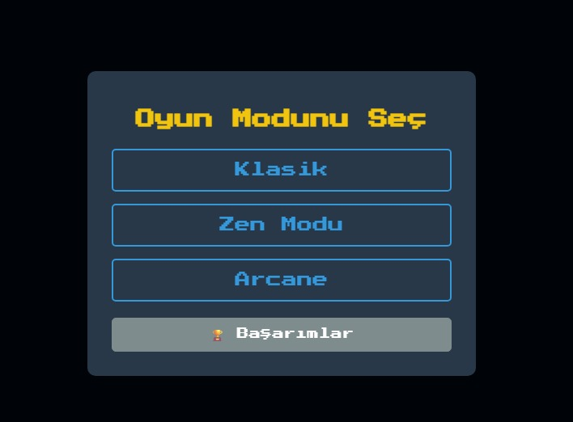
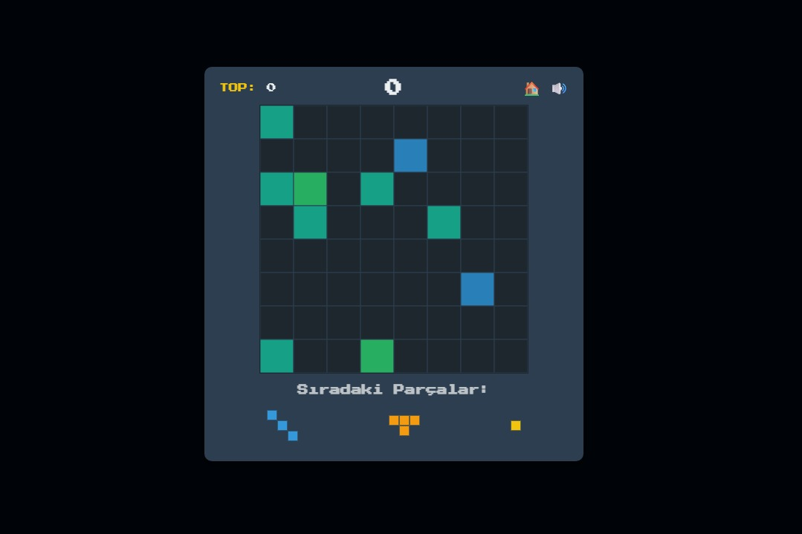
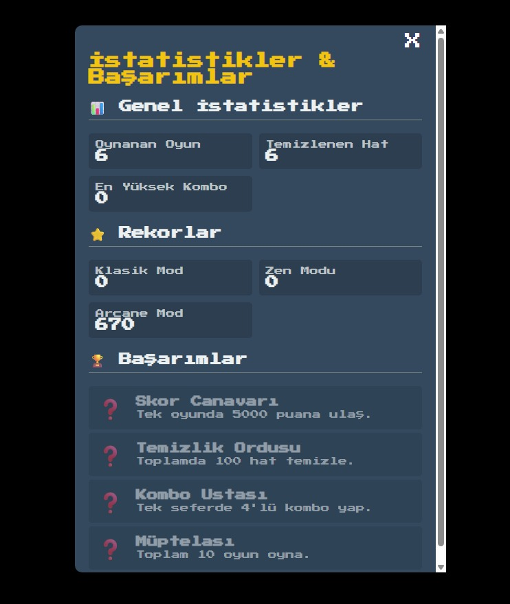

# Pixel Blok Bulmaca 🚀

Klasik blok bulmaca mekaniklerini modern özellikler ve retro bir uzay temasıyla birleştiren, web tabanlı keyifli bir bulmaca oyunu.

**Canlı Demo:** **[Oyunu Oynamak İçin Tıkla!](https://tetrisgame-vert.vercel.app/)**

### Ekran Görüntüleri

| Ana Menü | Klasik Mod | Başarımlar |
|:---:|:---:|:---:|
|  |  |  |

---

## 🎮 Oyun Hakkında

Bu oyun, oyuncuların 8x8'lik bir ızgaraya çeşitli şekillerdeki blokları yerleştirerek satırları ve sütunları temizlemesini amaçladığı bir bulmaca oyunudur. Amaç, yerleştirecek yer kalmayana kadar en yüksek skoru elde etmektir. Oyun, farklı zorluk ve heyecan seviyeleri sunan üç farklı moda sahiptir.

---

## ✨ Özellikler

* **Klasik Blok Bulmaca Mekaniği:** 8x8'lik ızgarada hem satırları hem de sütunları temizleme.
* **Üç Farklı Oyun Modu:**
    * **Klasik:** Rastgele başlangıç bloklarıyla standart bir meydan okuma.
    * **Zen Modu:** Rahatlatıcı ve sonsuz bir oyun deneyimi için boş tahta.
    * **Arcane Modu:** Oyuna heyecan katan Bomba ve Lazer gibi özel güçlendirmeler!
* **Gelişmiş Geri Bildirim ve Efektler:**
    * **Hayalet Blok:** Parçayı nereye koyacağını gösteren yerleşim önizlemesi.
    * **Hat Tamamlama Uyarısı:** Bir hattı tamamlayacak hamlelerde parlayan ızgara.
    * **Kombo Sistemi:** Aynı anda birden fazla hat temizlendiğinde "KOMBO!" yazısı ve ekran sallanma efekti.
    * **Animasyonlar:** Akıcı parça gelişleri, puan artışları ve hat temizleme animasyonları.
* **Kişisel Gelişim Takibi:**
    * Her mod için ayrı ayrı kaydedilen **En Yüksek Skorlar**.
    * **Başarımlar ve İstatistikler** sistemi ile uzun vadeli hedefler.
    * Tüm veriler tarayıcının `localStorage`'ında saklanır.
* **Modern Arayüz:**
    * **Pixel Art Fontları** ve retro oyun estetiği.
    * Performansı yormayan, parıldayan yıldızlardan oluşan **hareketli uzay arka planı**.
    * **Ses Efektleri** ve sesi açıp kapatma butonu.
* **Mobil Uyumlu Tasarım:** Dokunmatik ekranlarda da rahatça oynanabilir.

---

## 🛠️ Kullanılan Teknolojiler

Bu proje, herhangi bir kütüphane veya framework kullanılmadan, tamamen temel web teknolojileri ile geliştirilmiştir:

* **HTML5**
* **CSS3** (Animasyonlar için Keyframes, düzen için Flexbox/Grid)
* **Vanilla JavaScript (ES6+)**

---

## 💻 Yerel Olarak Çalıştırma

Projeyi kendi bilgisayarında çalıştırmak için:

1.  Bu depoyu klonlayın veya ZIP olarak indirin.
2.  `index.html` dosyasına çift tıklayarak herhangi bir modern web tarayıcısında açın.
3.  `sfx` ve `screenshots` klasörlerinin ve diğer dosyaların aynı dizinde olduğundan emin olun.

Proje, herhangi bir build işlemi veya sunucu gerektirmez.

---

## 🚀 Gelecekte Eklenebilecekler

* **Parça Saklama ("Hold") Özelliği:** Oyuncunun bir parçayı daha sonra kullanmak üzere saklayabilmesi.
* **Parça Döndürme:** Oyuncuya daha fazla esneklik sağlamak için parçaları 90 derece döndürme imkanı.
* **Genel Liderlik Tablosu (Leaderboard):** Oyuncuların skorlarını bir sunucuya kaydederek birbirleriyle yarışması.

##İletişim
semihmertsariyerli.06@gmail.com
